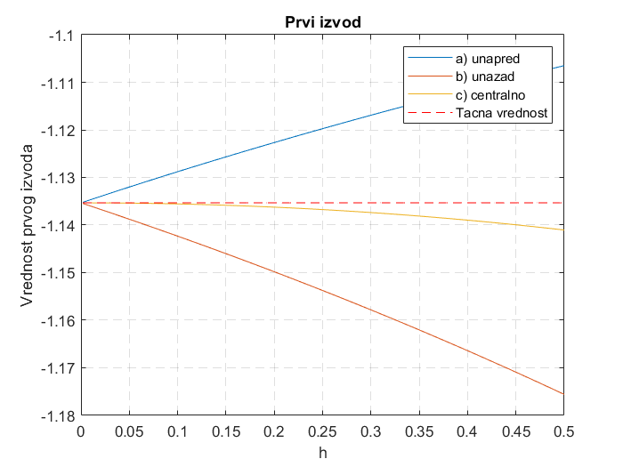
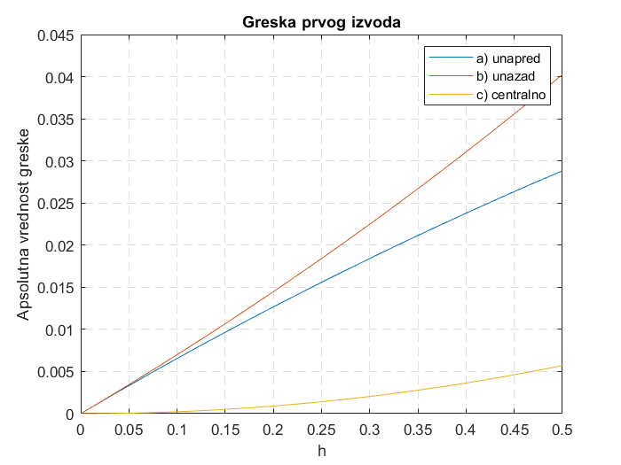
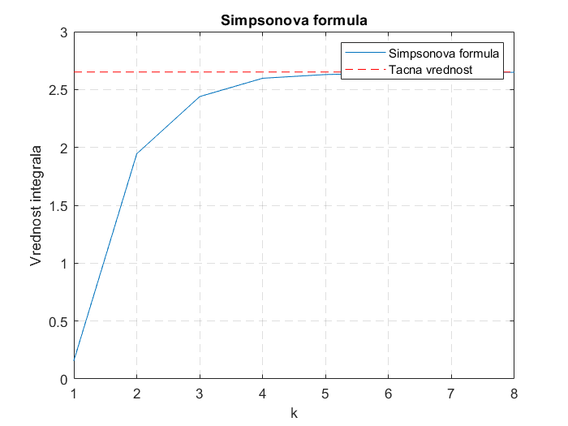
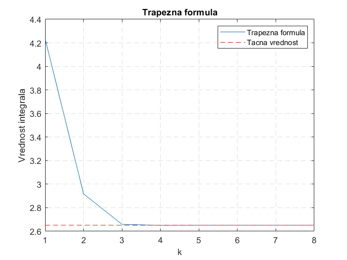
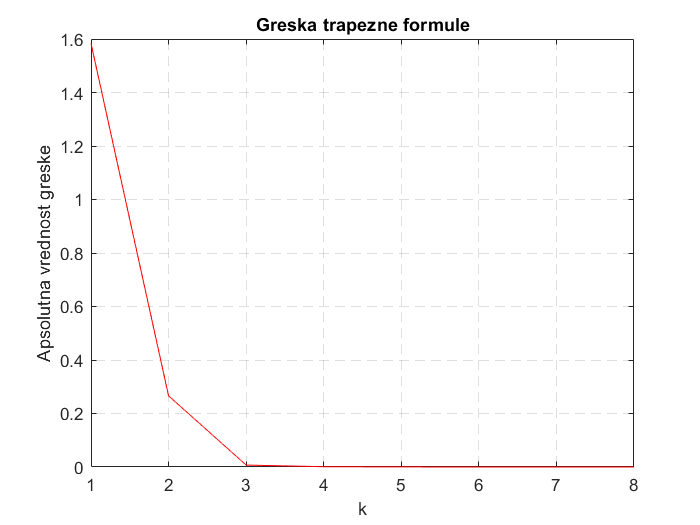

# numerical-methods
[Numerical Analysis] Numerical differentiation and integration using MATLAB.

Homework/project in **Numerical Analysis and Discrete Mathematics (13E082NAD)** at the University of Belgrade, School of Electrical Engineering.

## Numerical methods

### Numerical differentiation

```diferenciranje.m``` provides a MATLAB script to calculate the first derivative of the given function using:
* a) forward divided difference method
* b) backward divided difference method
* c) central divided difference method.



The error of these numerical methods are also given below:



### Numerical integration

```trapez.m``` provides a MATLAB script to calculate the definite integral of the given function using the trapezoidal rule.



The error for variable interval width is also given below:


```simpson.m``` provides a MATLAB script to calculate the definite integral of the given function using the Simpson's rule.



The error for variable interval width is also given below:


